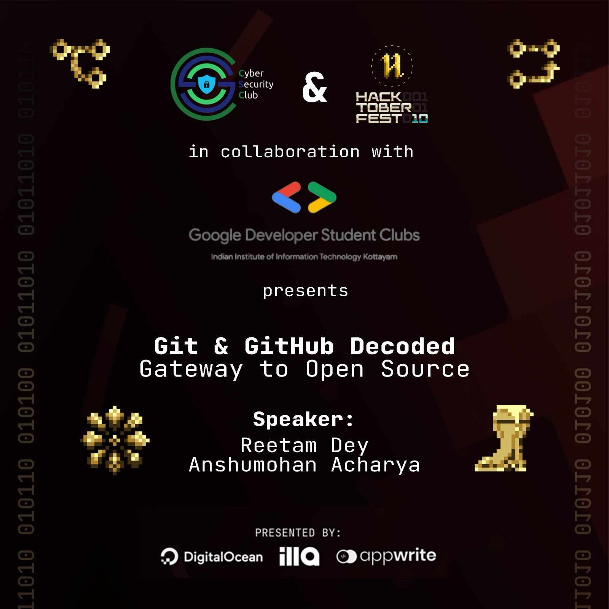
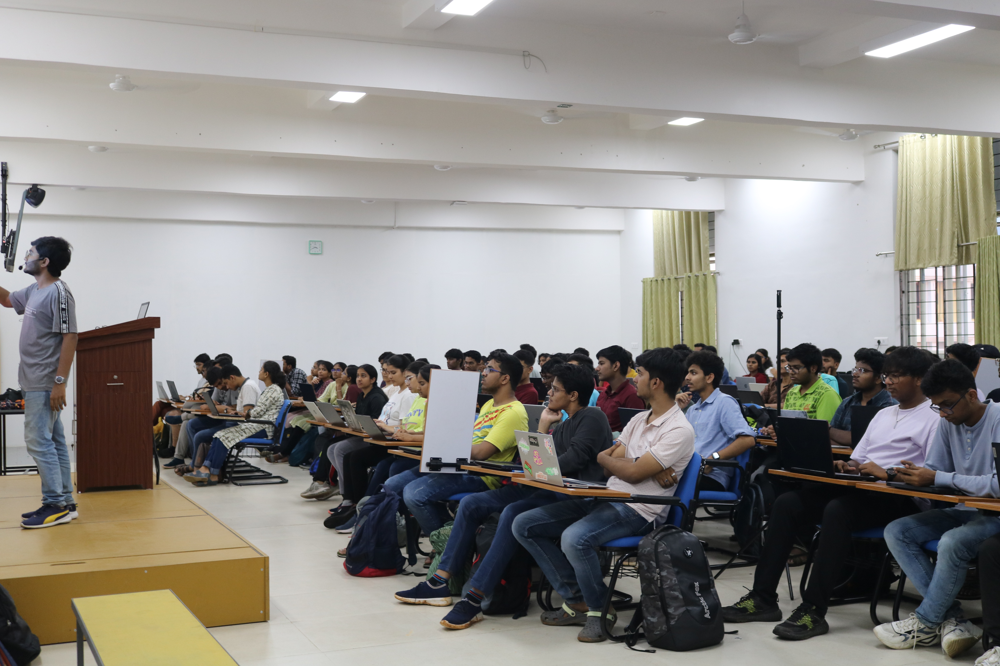
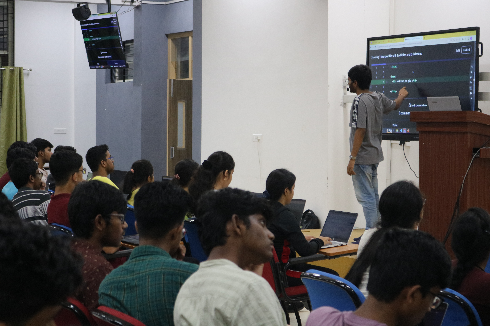

<h1 align="center">
    
    
        Cyber Security Club
    
</h1>

<h2>Git and Github: Gateway to Open Source</h2>
<section>
    

        

            
             
            <h2>About the Event</h2>
            
<pre>
 Date: 11 October, 2023               Venue: IIITK Campus
</pre>

            
🚀 Hey Tech Trailblazers! 🌟
 
🎉 Get ready to embark on an epic tech journey with GDSC and Cybersecurity Club IIIT Kottayam as we celebrate HacktoberFest! 🎃✨
 
Join us for an electrifying session where you'll uncover the magic of Git and GitHub, the superpower duo of version control systems! 🦸‍♂️💻 We're here to demystify the world of VCS and unveil the limitless open-source opportunities HacktoberFest has in store. 🌍
 
🔥 Meet our own expert  speakers, Reetam Dey and Anshumohan Acharya, who'll not only teach you the tech ropes but also answer all your burning questions! 🗣️💡
 
Ready to step out of your tech comfort zone and dive into the realm of global collaboration? 🌐✨ This event is tailor-made for every one of you out there! 🚀
 
Don't let this opportunity slip through your fingertips—reserve your spot now via this magical link: 
 

So, mark your calendars, and let's set sail on this incredible tech adventure together! 🌌💫 #HacktoberFest #GDSC #CSYClub

            
 <h2>Speakers:</h2>
 <h3>Reetam and Anshumohan</h3>
    
    
            
<h2>Participants: 150+</h2>
            
            

### Resources:

[Session Presentation](git_github_PPT.pptx)
 

[Datasheet](Git_and_Github_Datasheet_credits-Linkedin.pdf)
