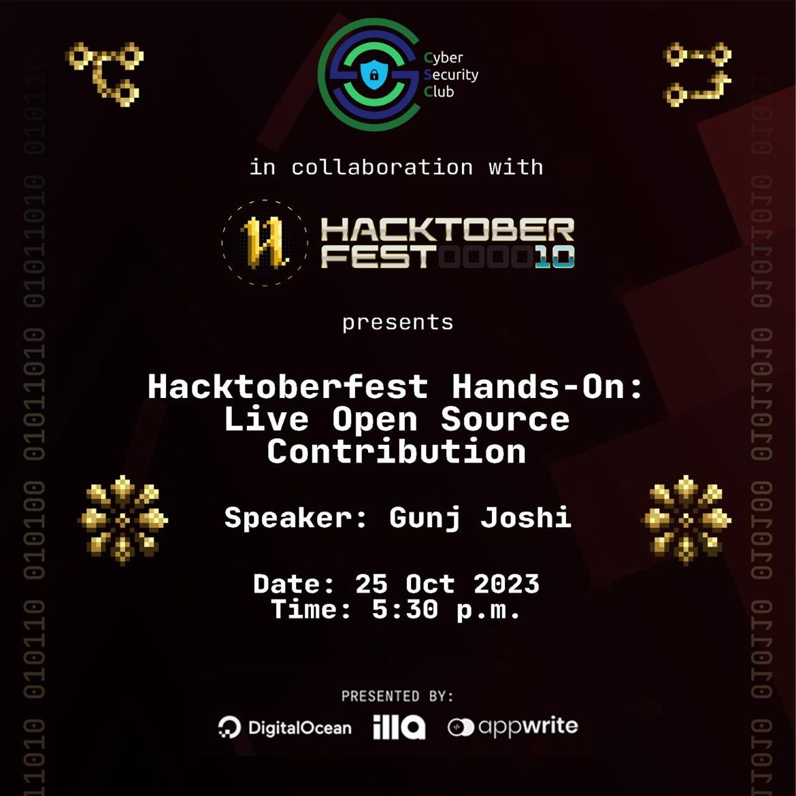
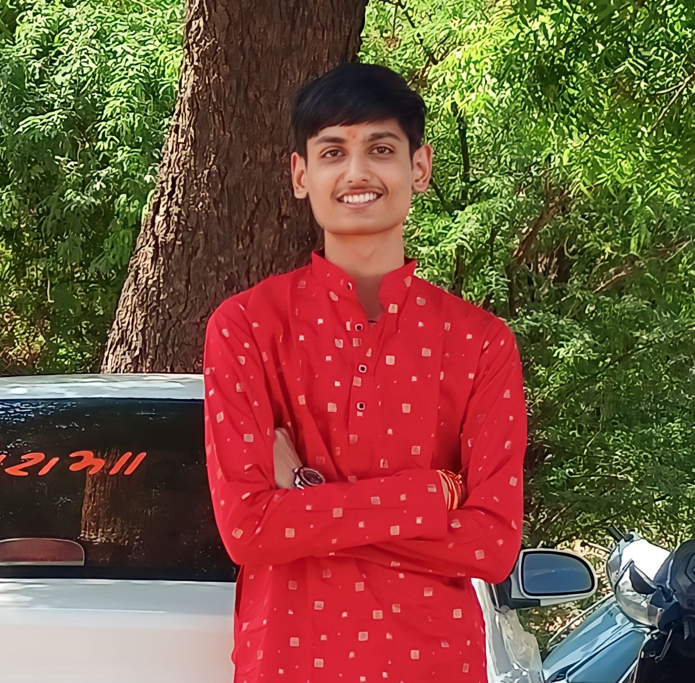
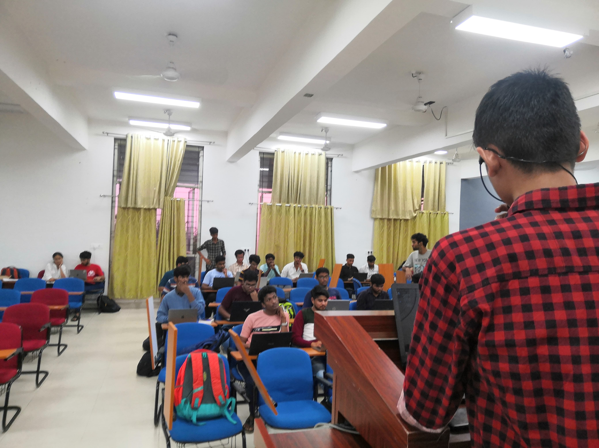
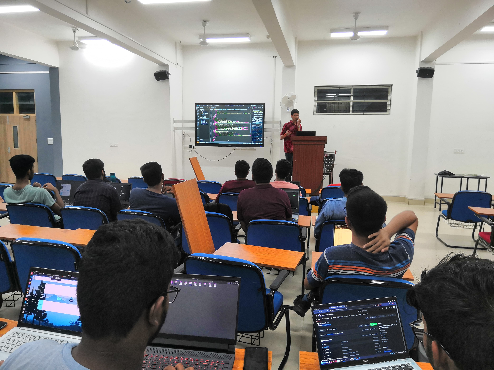

<h1 align="center">
    
    
        Cyber Security Club
    
</h1>

<h2>CSY Hactober Fest Hands On: Live Open Source Contribution</h2>
<section>
    

        

            
             
            <h2>About the Event</h2>
            
<pre>
 Date: 25 October, 2023               Venue: IIITK Campus
</pre>

            
We're back and this time it's all about diving headfirst into the exciting world of open source and community contributions. As part of the ongoing Hacktoberfest, we're continuing our journey of giving back to the coding community.
 
In follow-up with our previous sessions, we will make contributions to the community space, the CSY club’s cipher project, Ecocrypt🍀, and our club’s website too! Get your hands dirty (figuratively, of course) and leave your mark on the virtual canvas.
 
This session promises to be fun, engaging, and, most importantly, hands-on. So, don't forget to get your laptops and be a part of a tech adventure that's not just about learning but also giving back to the community.
 
See you there!🌟💻

            
 <h2>Speaker:</h2>
 <h3>Gunj Joshi</h3>
    
            
<h2>Participants: 30+</h2>
            
            

### Resources:

[Session Presentation](hands-on-hacktoberfest-2023-gunjjoshi.pptx)
 

[Hactoberfest Resources](https://csyclubiiitk.notion.site/csyclubiiitk/Hacktoberfest-Resources-444c8f7a210841b9ae993d8aab47c33e)