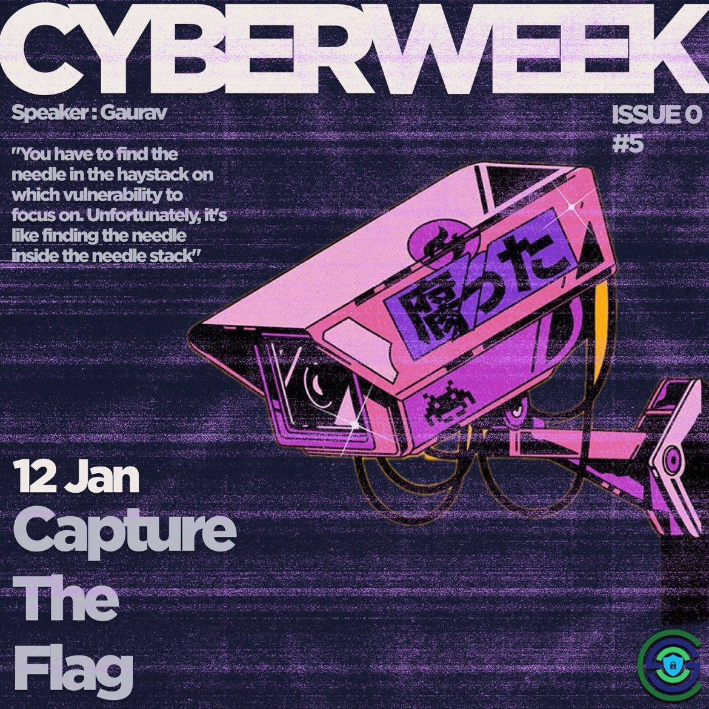
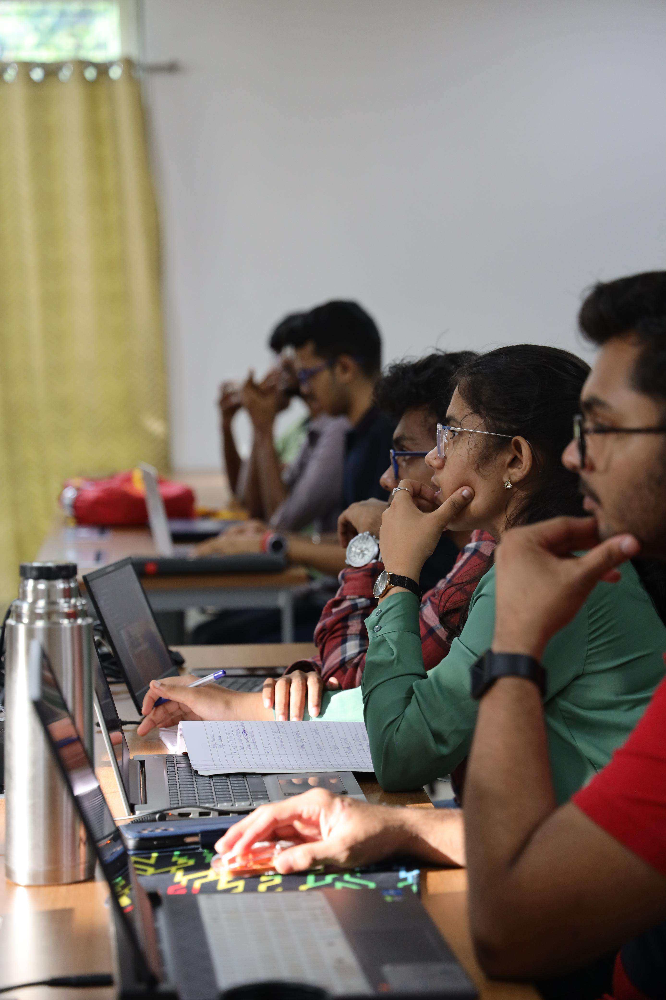
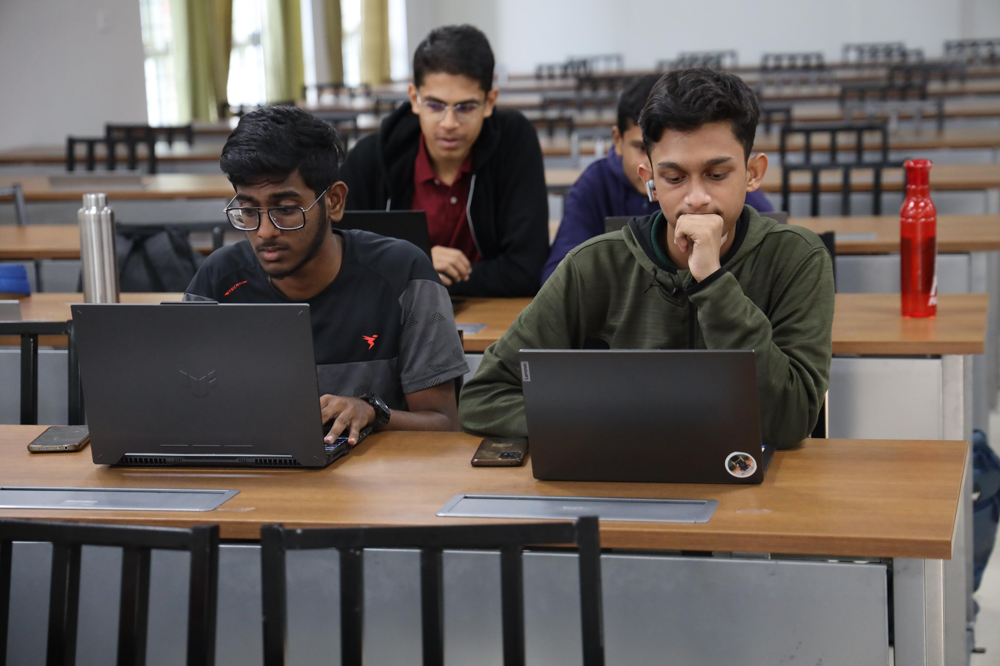

<h1 align="center">
    
    
        Cyber Security Club
    
</h1>

<h2>Cyber Week: Capture the Flag</h2>
<section>
    

        

            
             
            <h2>About the Event</h2>
            
<pre>
 Date: 12 January, 2024               Venue: IIITK Campus
</pre>

            <h2>Description:</h2>
            <h3>What to expect:</h3>

* ⁠Intro to Capture the Flag(CTF) 
* ⁠Venturing into domains of CTF * ⁠Resources to explore and learn CTF

            
 <h2>Speaker:</h2>
 <h3>Gaurav</h3>
    

<h2>Participants: 30+</h2>
    
    

### Resources:

[Session Presentation](https://docs.google.com/presentation/d/1a9yJdK-ApbEgnCOeDmW-BlH-ALGfbO83gzdwlpRcCmY/edit?usp=sharing)