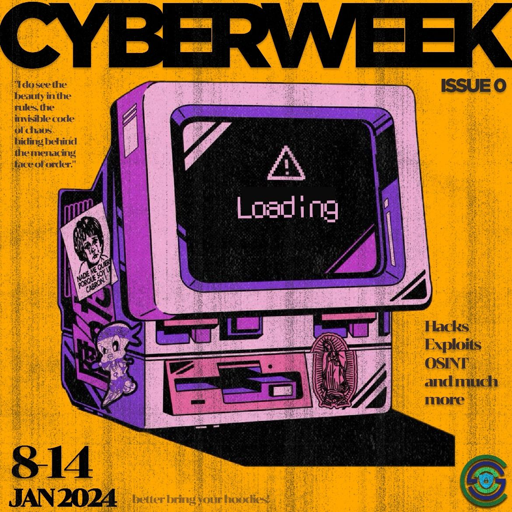

<h1 align="center">
    
    
        Cyber Security Club
    
</h1>

<section>
    

        

            <h2>Cyber Week</h2>
            
            
<pre>
 Date: 8-14 January, 2024               Venue: IIITK Campus
</pre>

             
            
Greetings connections!

The cyber security club is delighted to announce “Cyber Week”, a week long event featuring
- [OS-INT](os-int)
- [Networks & NMAP](networks-and-nmap)
- ⁠[Exploitation tools](exploitation-tools)
- ⁠[Breaking the Websites for Fun](breaking-websites-for-fun-and-profit)
- ⁠[Capture the Flag](capture-the-flag)

Mark your calendars from the 8th of January till the 14th.

        

    

</section>
</body>
