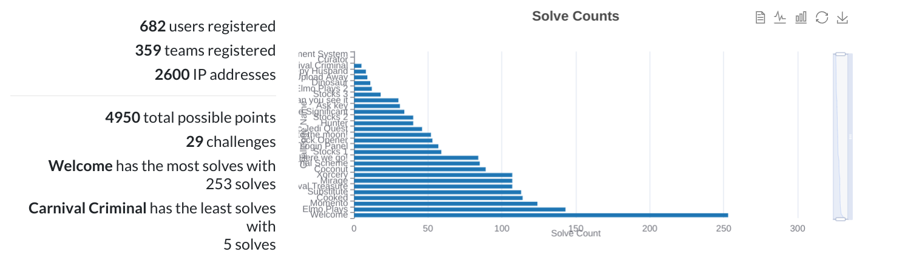

# Apoorv CTF '24

🚀 The 2nd edition of the annual Techno-Cultural Fest, Apoorv Capture the Flag (CTF) 2024 at IIIT Kottayam, was an electrifying event, surpassing last year's success with over 600 participants. 

🌐 Held online in February/March 2024, the event featured a thrilling Capture the Flag competition, engaging workshops, tech talks by industry experts, and captivating cultural events. 

🎵 Participants enjoyed groovy music, delicious food, and exciting prizes, along with networking opportunities. 

📣 The fest, supported by numerous sponsors, provided an inspiring and exhilarating experience in the world of cybersecurity and technology.

### Stats
