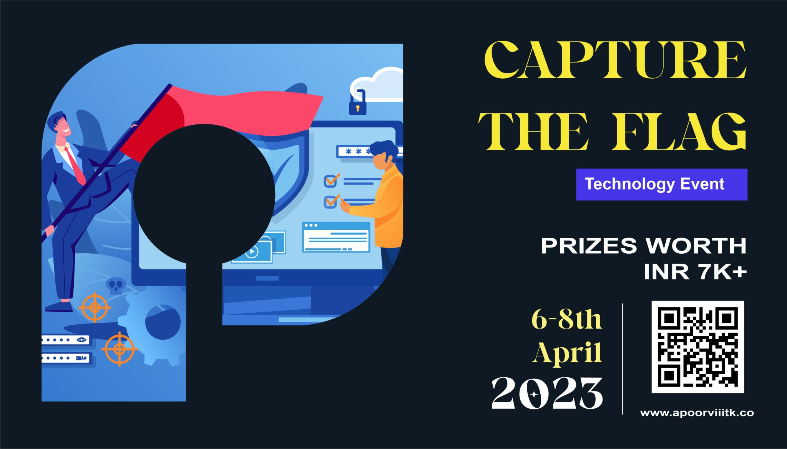

<h1 align="center">
    
    
        Cyber Security Club
    
</h1>

# Event

<section>
    

        

            
            <h2>Capture The Flag (Contest) </h2>
            
<pre>
Date: 6-8 April, 2023 Venue: Online (CTFd Platform)
</pre>

             
            

                We are thrilled to announce that, Cyber Security Club IIIT Kottayam is hosting its first CTF for the Techno Cultural Fest of IIIT Kottayam , Apoorv IIIT Kottayam.
                Are you ready to put your skills to the test and compete in a thrilling game of strategy, teamwork, and cunning? Then join us for our upcoming Capture The Flag 🚩 event! The competition won't just be limited to the challenges – players will need to work together and strategize to outsmart their opponents and claim victory. 
                So gather your team, practice your skills, and get ready for a day of high-stakes competition and unforgettable memories. We'll see you on the battlefield! 
            

        

    

    
Join the discord [Server](https://discord.com/invite/m8qrYCfY)

#### Cheeckout Challenges, writeups: [CTF](https://github.com/CSYClubIIITK/ApoorvCTF-23-Writeups)
</section>
</body>

### Stats

