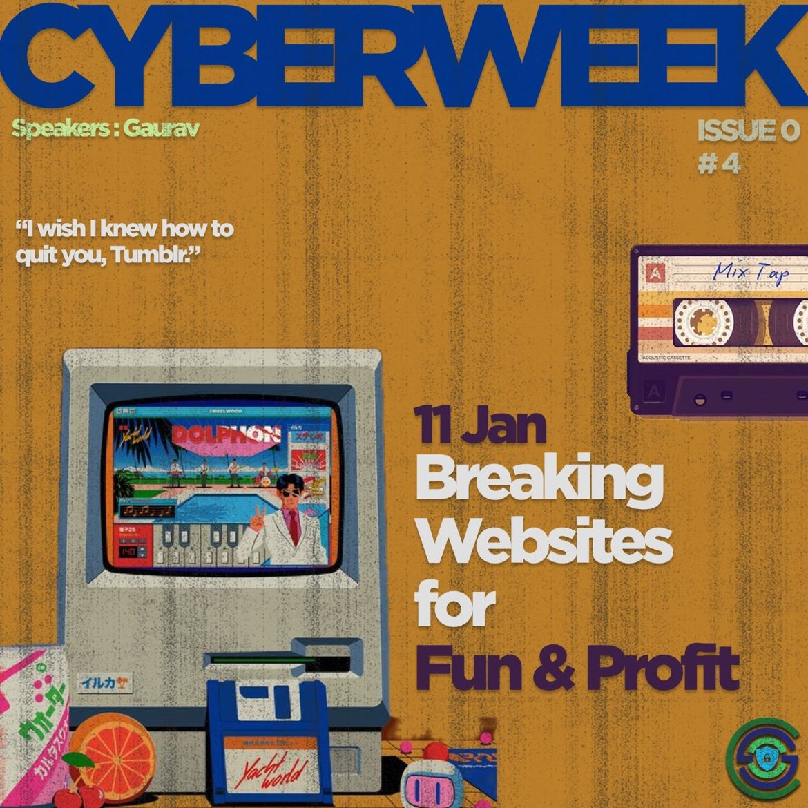
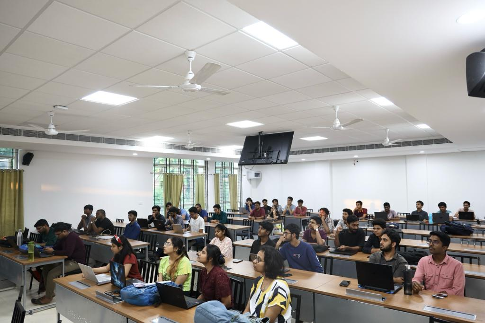
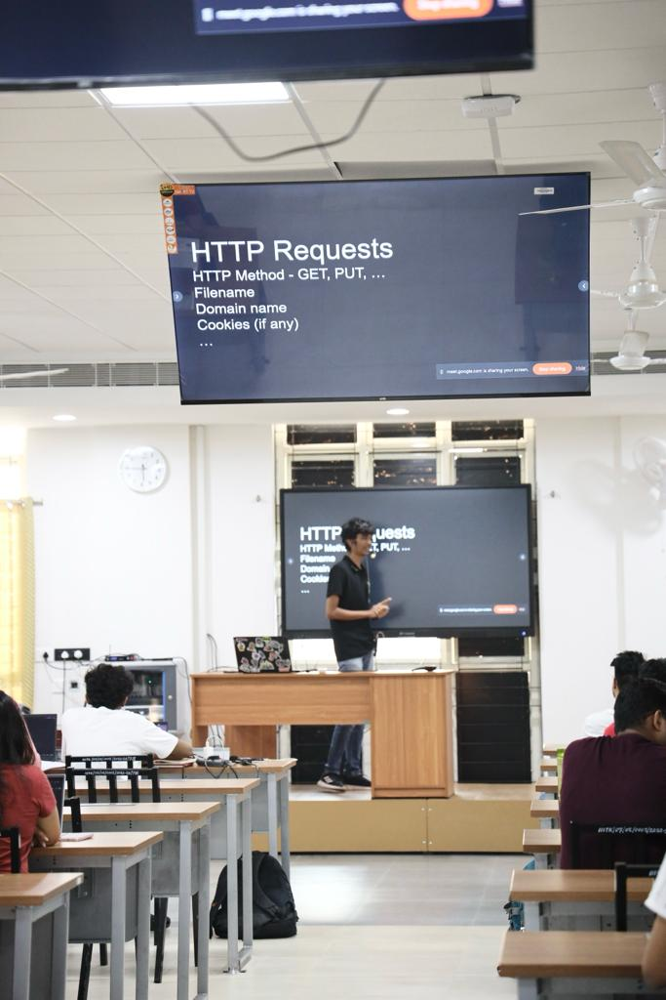

<h1 align="center">
    
    
        Cyber Security Club
    
</h1>

<h2>Cyber Week: Breaking the Websites for Fun</h2>
<section>
    

        

            
             
            <h2>About the Event</h2>
            
<pre>
 Date: 11 January, 2024               Venue: IIITK Campus
</pre>

            <h2>Description:</h2>
            
Day 4 of CYBER WEEK saw our participants explore the intriguing theme of "breaking websites for fun." 🔐

Unveiling the risks associated with phishing 🎣, this session aimed to promote awareness and responsible online behavior. 👤💻

As we inch closer to the end of CYBER WEEK, stay tuned for another fun session!✨

 <h2>Speaker:</h2>
 <h3>Gaurav</h3>
    

<h2>Participants: 30+</h2>
    
    
            

### Resources:

[Session Presentation]()