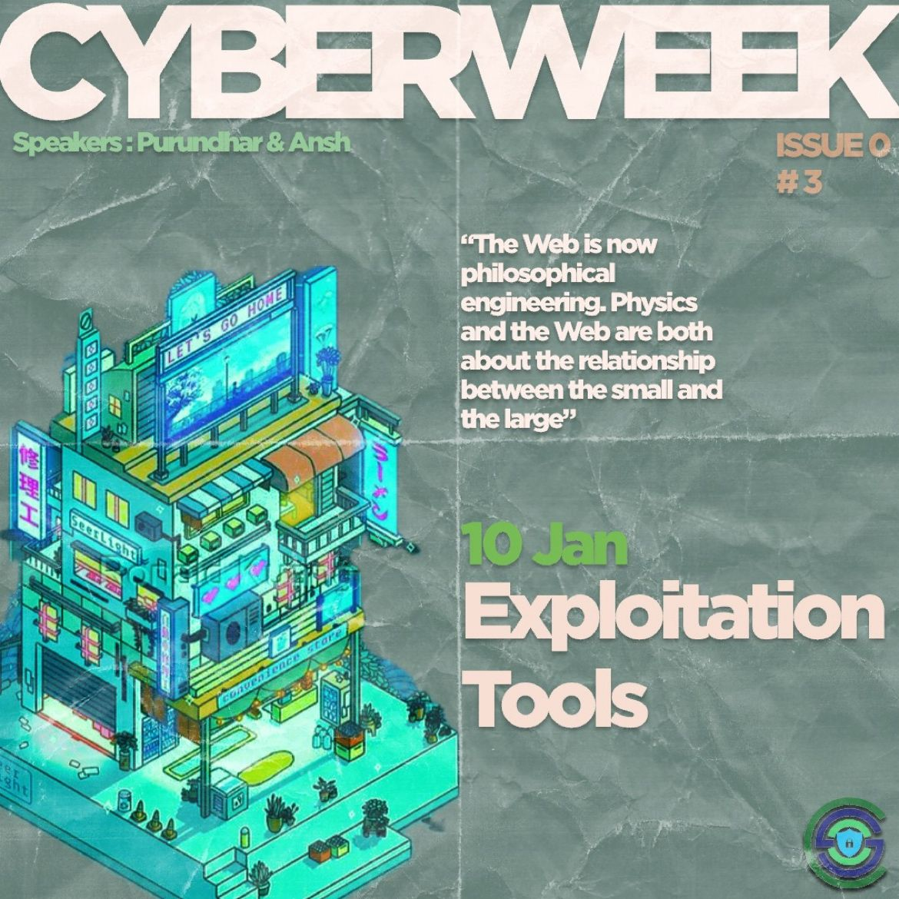

<h1 align="center">
    
    
        Cyber Security Club
    
</h1>

<h2>Cyber Week: Exploitation Tools</h2>
<section>
    

        

            
             
            <h2>About the Event</h2>
            
<pre>
 Date: 10 January, 2024               Venue: IIITK Campus
</pre>

            <h2>Description:</h2>
            
The 3rd day of CYBER WEEK saw our speakers delve into the exciting world of exploitation tools, with a focus on password cracking and man-in-the-middle attacks. They demonstrated the utilization of various tools, providing the participants with valuable insights into the dark arts of cybersecurity. 🥷🌟

Keep an eye out for more such exciting sessions!✨

            
 <h2>Speakers:</h2>
 <h3>Purandhar & Ansh</h3>
    
    

<h2>Participants: 50+</h2>
    
    

### Resources:

[Session Presentation]()