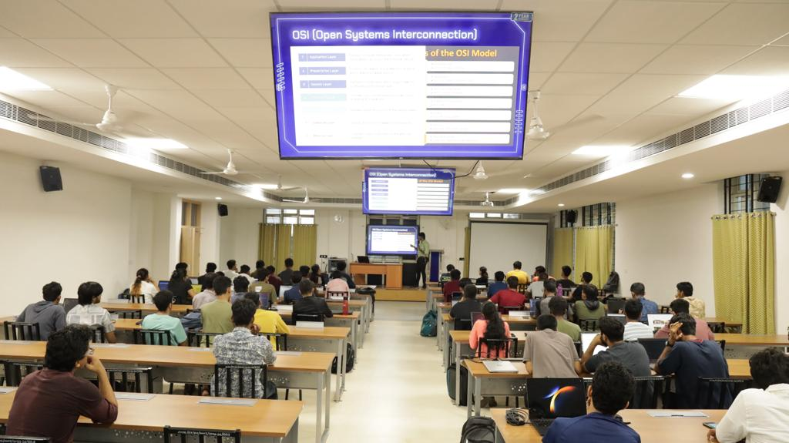

<h1 align="center">
    
    
        Cyber Security Club
    
</h1>

<h2>Cyber Week: Network & Nmap</h2>
<section>
    

        

            
             
            <h2>About the Event</h2>
            
<pre>
 Date: 09 January, 2024               Venue: IIITK Campus
</pre>

            <h2>Description:</h2>
            
Join us on Day 2 of Cyber Week for an enlightening session, where our speaker Darisi Priyatham will guide you through the intricate world of networks and Nmap. 

Explore the depths of cybersecurity knowledge and gain insights that will empower your understanding of these crucial aspects.

The session on Networks and Nmap headed by our speaker Darisi Priyatham was fun and informative! 🌐

A hands-on demo was given to the participants too. 👩🏼‍💻👨🏼‍💻
Stay tuned for more such sessions throughout the week🌟

 <h2>Speakers:</h2>
 <h3>Darisi Priyatham</h3>
    

<h2>Participants: 100+</h2>
    
    
    
### Resources:

[Session Presentation](https://docs.google.com/presentation/d/1tg6Ld1OKXBkM3pzKNaBvVRgw7qSOzxG7gACruoX4SBY/edit?usp=sharing)
