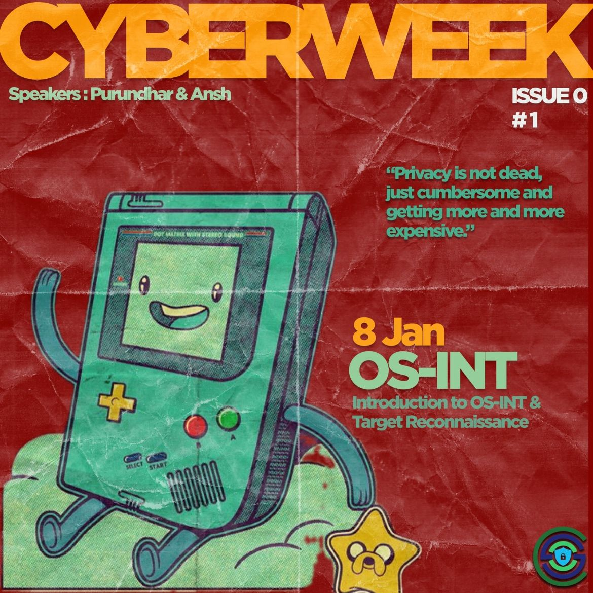
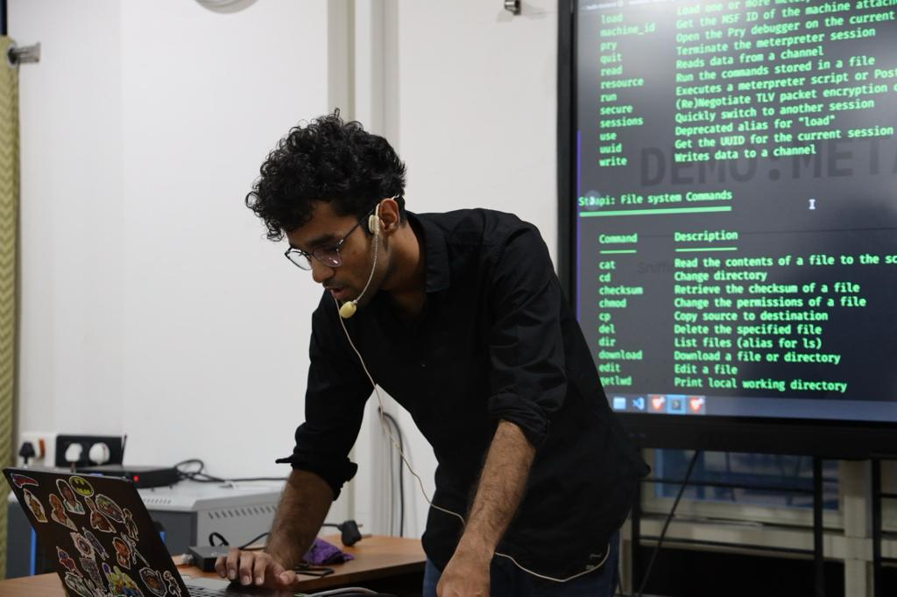
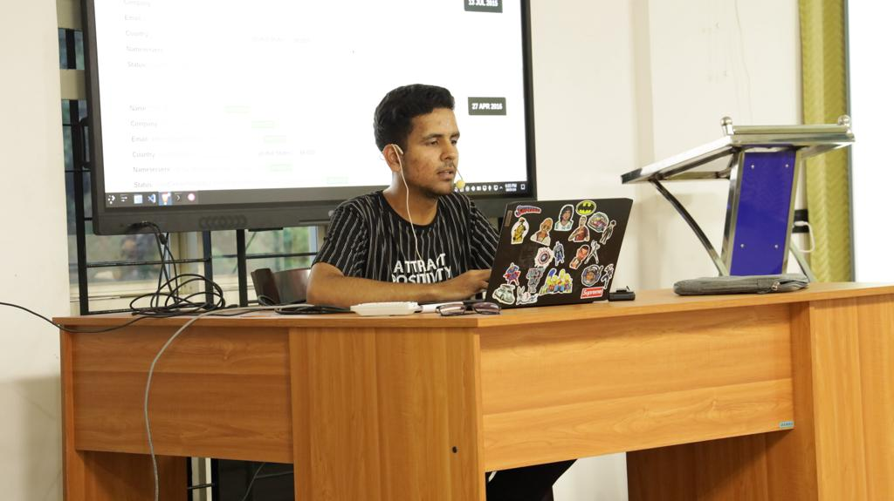
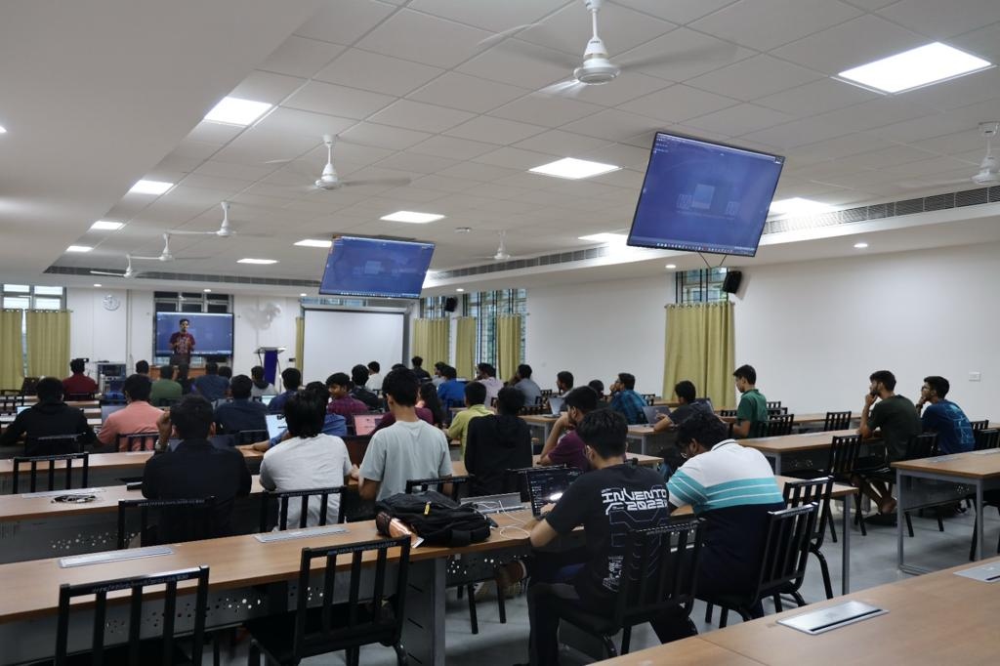
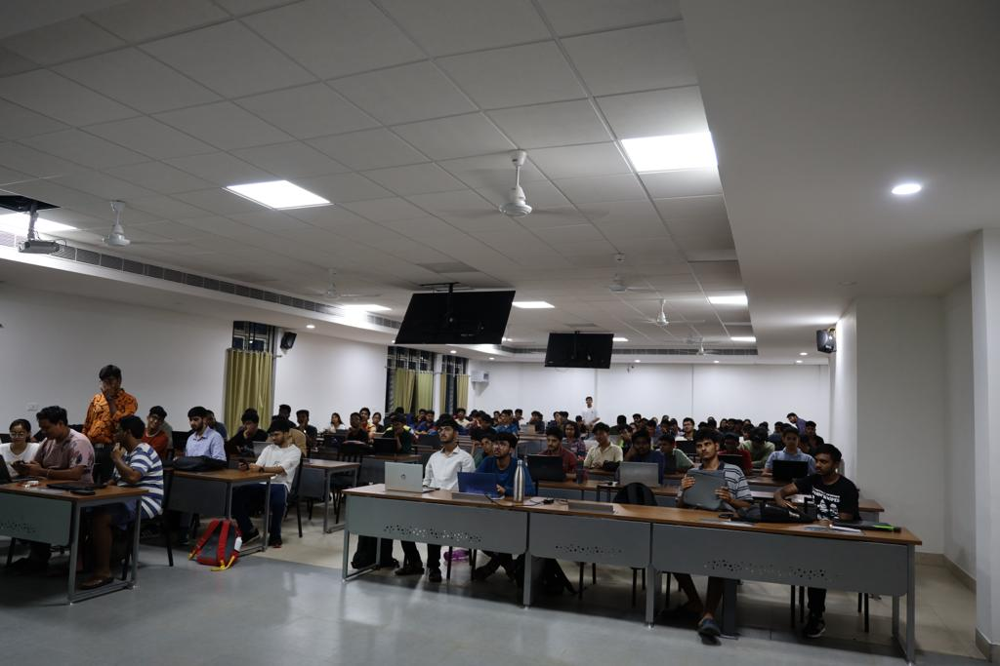

<h1 align="center">
    
    
        Cyber Security Club
    
</h1>

<h2>Cyber Week: OS-INT</h2>
<section>
    

        

            
             
            <h2>About the Event</h2>
            
<pre>
 Date: 08 January, 2024               Venue: IIITK Campus
</pre>

            <h2>Description:</h2>
            
Day 1 of CYBER WEEK was an amazing success with our speakers Purandhar and Ansh diving deep into the mesmerising world of OS-INT. 

The session ended with a surprise announcement about Cyber Night! Episodes of the infamous series “Mr. Robot” will be streamed every night of the week. 

Stay tuned for more!

 <h2>Speakers:</h2>
 <h3>Purandhar & Ansh</h3>
    
    

<h2>Participants: 80+</h2>
    
    

### Resources:

[Session Presentation](https://docs.google.com/presentation/d/1evvvABUXM8ebZ8AJu6eGgivZ49UloMELF0tQMNDBxI0/edit?usp=sharing)