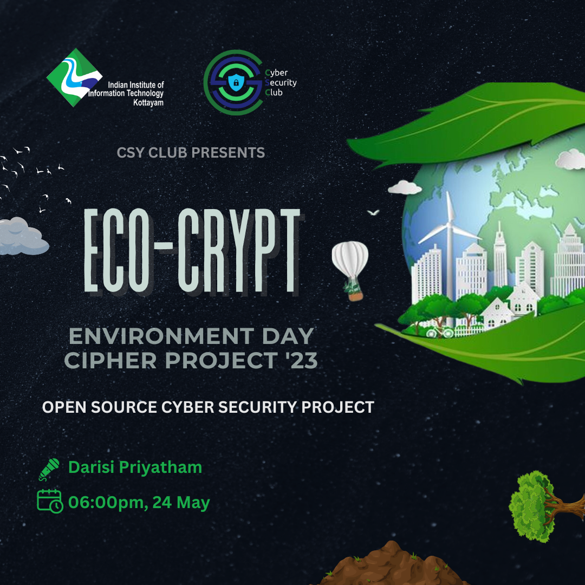

<h1 align="center">
    
    
        Cyber Security Club
    
</h1>

<section>
    

        

             <h2>EcoCrypt</h2>
            
            
<pre>
 Date: 24 May, 2023               Venue: IIIT Kottayam
</pre>

             
            
🌿 Join us for ECO-CRYPT Cipher Project '23! 🌍🔒 Celebrate Environment Day with a cybersecurity twist! 🚀🔐 Explore open-source magic, master GitHub, and unravel the secrets of ciphers. 🌱🔓 Encrypt ASCII characters into captivating emojis and share securely via WhatsApp! 📲💬 Dive into the intersection of nature and cybersecurity. Don't miss out! 🌿🔒💚  #ECOCRYPT #EnvironmentDay #CyberSecurity #OpenSource

        

    

 <h2>Speaker: Darisi Priyatham</h2>

 <h2>Participants: 50+</h2>
