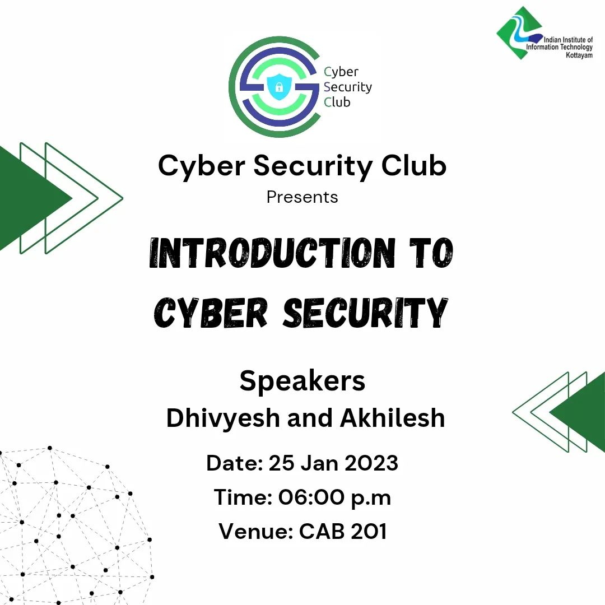

<h1 align="center">
    
    
        Cyber Security Club
    
</h1>

<h2>Introduction to Cyber Security</h2>
<section>
    

        

            
             
            <h2>About the Event</h2>
            
<pre>
 Date: 25 January, 2023               Venue: IIITK Campus
</pre>

            
Attention all tech-savvy students! Are you ready to dive into the thrilling world of cyber security and learn how to safeguard your digital assets?  Then come join us in CAB201 at 6 pm for an introduction to the field that will blow your mind!  Don't miss out on this opportunity to sharpen your skills and stay one step ahead of the hackers. See you there!

            
 <h2>Speakers:</h2>
 <h3>Akilesh, Divyesh</h3>
    
    
            
<h2>Participants: 70+</h2>
            
            

### Resources:

[Session Presentation](https://github.com/DPRIYATHAM/ClubVault/blob/main/Events/Introduction%20to%20Cyber%20Security/Cyber%20Threats%20and%20Networking.pdf)
