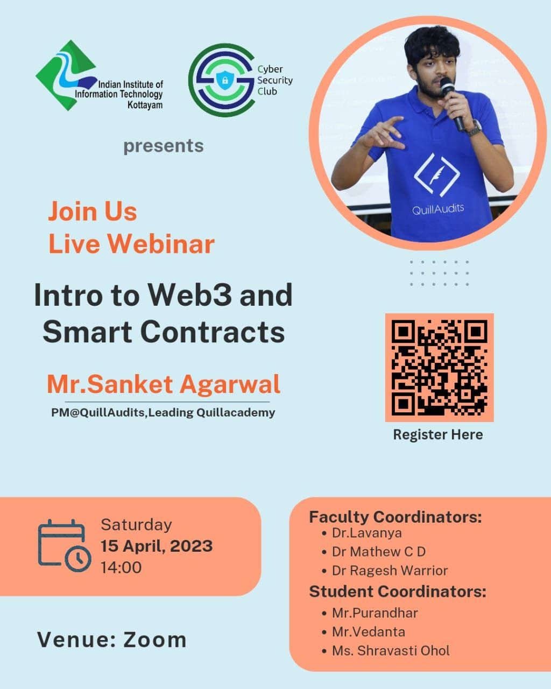

<h1 align="center">
    
    
        Cyber Security Club
    
</h1>

<section>
    

        

             <h2>Introduction to Web 3.0 and Smart Contracts (Webinar)</h2>
            
            
<pre>
 Date: 15 April, 2023               Venue: Zoom
</pre>

             
            
During this webinar, you will learn about the fundamentals of Web 3.0, blockchain, and smart contracts, careers in Web3 and more. Our guest speaker, Mr. Sanket Agarwal has worked with and consulted multiple Web3 startups. He has built and scaled Quillcheck, a rug pull detection tool. He has managed multiple Web3 development and security projects.  He has experience in teaching 20,000+ students around web3.0, and cybersecurity in South East Asia. Don't miss this incredible opportunity to upskill yourself and stay ahead of the curve in the ever-changing world of technology. Register now for the webinar on ‘Introduction to Web 3.0 and Smart Contracts.

        

    

## Feedback:

<pre>

I recently had the opportunity to attend the Cyber Security Club's webinar on 'Introduction to Web 3.0 and Smart Contracts,' and it was truly informative and enlightening. The guest speaker, Mr. Sanket Agarwal, shared his vast experience and knowledge, and provided valuable insights into the potential career opportunities in this field. I was particularly impressed by his teaching style, which was both engaging and easy to understand.The webinar was well-structured, and the content was delivered in a manner that was easy to follow, even for those who were new to the subject. I found the Q&A session to be particularly helpful, as it provided an opportunity to clarify any doubts that I had. Overall, The Cyber Security Club and Placement Cell have done an excellent job of organizing this event, and I am grateful for the opportunity to have attended it. Thank you! 
 -Gunj Joshi

</pre>

<pre>

Web 3.0 is the next evolution of the internet, where data is decentralized and controlled by users, and blockchain technology is a critical component of this decentralized ecosystem.  Smart contracts are self-executing contracts with the terms of the agreement between buyer and seller being directly  written into lines of code. These contracts are stored on a blockchain network,  enabling secure and transparent execution without the need for intermediaries. By utilizing smart contracts, Web 3.0 aims to create a more efficient and trustless system for transactions and interactions between users,  creating new opportunities for decentralized applications and disrupting traditional industries. 
 -Anshumohan

</pre>

