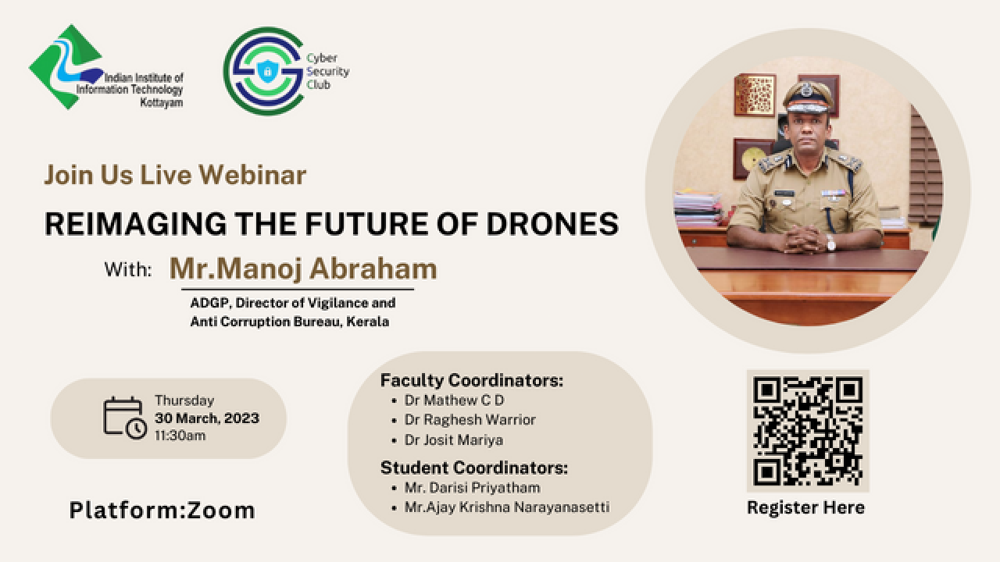

<h1 align="center">
    
    
        Cyber Security Club
    
</h1>

<section>
    

        

            <h2>Reimagining The Future of Drones (Webinar)</h2>
            
            
<pre>
 Date: 30 March, 2023               Venue: Zoom
</pre>

             
            
Drones have become increasingly popular over the years, with advancements in technology making them more accessible and affordable. While drones have many practical uses, they also pose a significant security threat if they fall into the wrong hands. In recent years, drones have been used to carry out a range of illegal activities, including GPS spoofing, espionage, and even terrorist attacks. As such, developing effective countermeasures to mitigate these risks is essential.

During this webinar, we will discuss the various threats posed by drones, including the challenges faced by law enforcement agencies in detecting and countering drone-based attacks. We will also explore the latest technologies and techniques for detecting and neutralizing drones.

        

    

</section>
</body>
