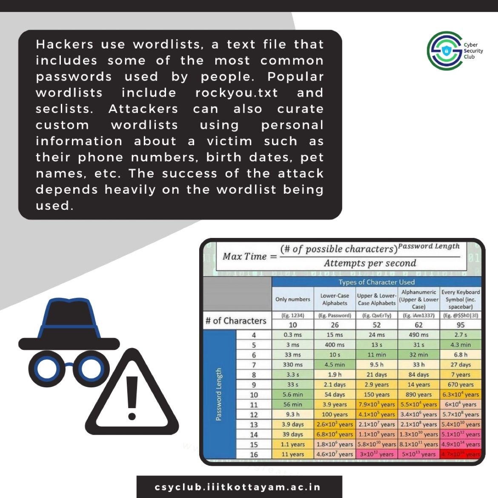

<h1 align="center">
    
    
        Cyber Security Club
    
</h1>

<h2>Weekly Series on cybersecurity content</h2>
<section>
    

        

            <h2>About the Event</h2>
            
<pre>
 Date: 16-31 December, 2023              Venue: Instagram, Linkedin
</pre>

            
Greetings connections!
 
We’re delighted to announce that we are beginning a series of engaging and informative posts related to the various aspects of cybersecurity tips to safeguard your devices against various threats on Instagram and sharing the summary of the week's content on LinkedIn.

### Week 1
* Malware - Cancer for your devices

    

        
        
        
    

* Phishing - Identity theft is not a joke
    

        
        
        
    

* Cloud storage security - Securing virtually stored data
    

        
        
        
    

### Week 2
* Brute Forcing : breaking your password
    

        
        
        
    

* Binary Exploitation
    

        
        
        
    

* Denial Of Service Attack
    

        
        
        
    

### Week 3
* Buffer Overflow - Too much of anything is bad
    

        
        
        
    

* IoT Attack - Your devices are smart but are they safe?
    

        
        
        
        
    

[Instagram](https://www.instagram.com/p/C0ea6a4PoFe/?img_index=1)