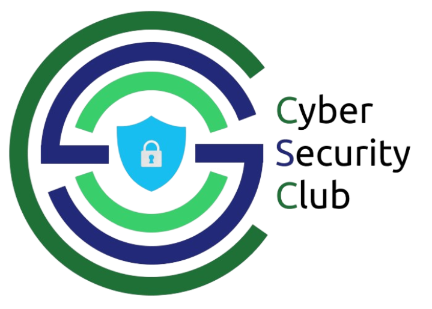

<head>
    <link rel="stylesheet" href="https://cdnjs.cloudflare.com/ajax/libs/font-awesome/4.7.0/css/font-awesome.min.css">
    
</head>
<body>
<h1 align="center">
    
    
        Cyber Security Club
    
</h1>

<h3 align="center">Securing the digital world, One byte at a time</h3>

    
    
    

---

<h4 align="center">
  <a href="../readme.md/#About">About</a> •
  <a href="#Events">Events</a> •
</h4>

---

 

# Events

<h2 style="text-align:center; font-size:2em;">
    Past Events
</h2>
<section>
    

        

            <h2>Introduction to Web 3.0 and Smart Contracts</h3>
            
            
            
            
            
             
            
During this webinar, you will learn about the fundamentals of Web 3.0, blockchain, and smart contracts, careers in Web3 and more. Our guest speaker, Mr. Sanket Agarwal has worked with and consulted multiple Web3 startups. He has built and scaled Quillcheck, a rug pull detection tool. He has managed multiple Web3 development and security projects.  He has experience in teaching 20,000+ students around web3.0, and cybersecurity in South East Asia. Don't miss this incredible opportunity to upskill yourself and stay ahead of the curve in the ever-changing world of technology. Register now for the webinar on ‘Introduction to Web 3.0 and Smart Contracts.

            <ul>
                <li><a href="Introduction to Web 3.0 and Smart Contracts/resources">Resources</a></li>
            </ul>
        

        
    

    
>     Hey Everybody! Feedback 1"
>                                   -Person 1

>     Hey Everybody! Feedback 2"
>                                   -Person 2

>     Hey Everybody! Feedback 3"
>                                   -Person 3

 

</section>
 
</body>