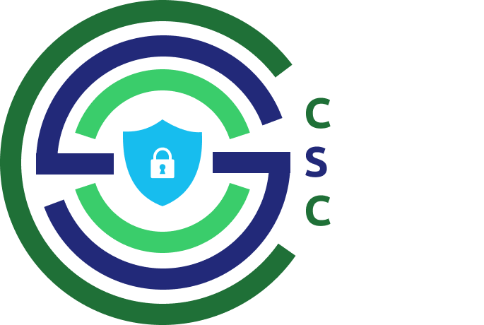
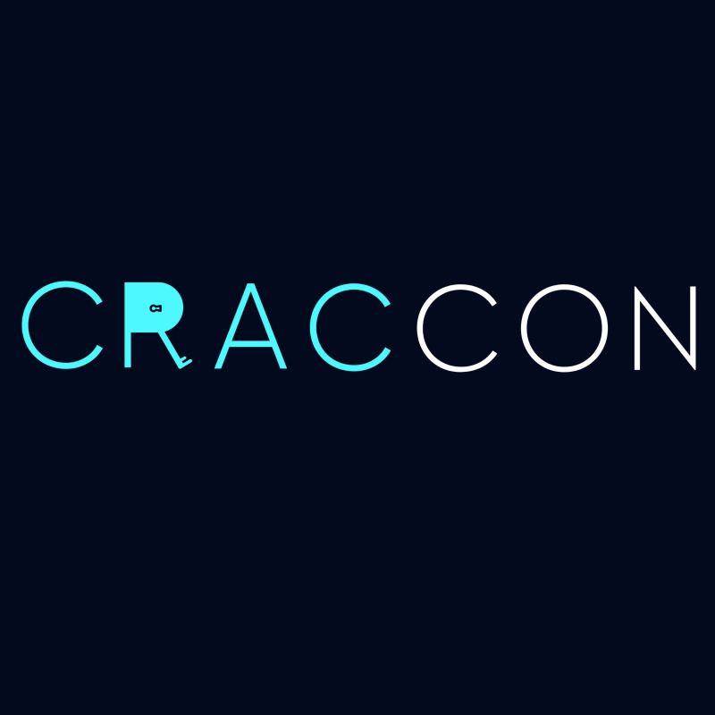
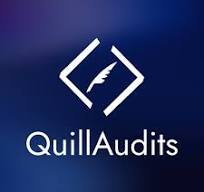

<h1 align="center">
    
    
        Cyber Security Club
    
</h1>

### Indian Institute of Information Technology Kottayam

## About Us

Welcome to the Cybersecurity Club of Indian Institute of Information Technology. This is a place where we share our knowledge, experience, and passion for cybersecurity. We aim to promote cybersecurity awareness and provide a platform for students to learn and grow in this field.

## Club Activities

- Introduction to Cyber Security - [Link](https://github.com/CSYClubIIITK/ClubVault/tree/main/Events/Introduction%20to%20Cyber%20Security)
- Reimagining The Future of Drones - [Link](https://github.com/CSYClubIIITK/ClubVault/tree/main/Events/Reimagining%20the%20future%20of%20drones)
- Capture The Flag - Apoorv 2023 - [Link](https://github.com/CSYClubIIITK/ClubVault/tree/main/Events/Apoorv%20Capture%20The%20Flag'23)
- Introduction to Web 3.0 and Smart Contracts - [Link](https://github.com/CSYClubIIITK/ClubVault/tree/main/Events/Introduction%20to%20Web%203.0%20and%20Smart%20Contracts)
- Open Source Cyber Security Event - EcoCrypt - [Link](https://github.com/CSYClubIIITK/ClubVault/tree/main/Events/EcoCrypt)
- Advanced Cryptography Digital-Forensics - [Github Repo](https://github.com/CSYClubIIITK/Advanced-Cryptography-Digital-Forensics)
- Cyber Security Club Introductory Session - [Link](https://github.com/CSYClubIIITK/ClubVault/tree/main/Events/Cyber%20Security%20Club%20Introductory%20Session)
- Hacktoberfest 2023 Intro Session - [Link](https://github.com/CSYClubIIITK/ClubVault/tree/main/Events/Hacktoberfest'23%20Intro%20Session)
- Hacktoberfest 2023 Git and Github Decoded- [Link](https://github.com/CSYClubIIITK/ClubVault/tree/main/Events/Hacktoberfest'23%20Git%20and%20Github%20Decoded)
- Hacktoberfest 2023 Hands On: Live Open Source Contribution- [Link](https://github.com/CSYClubIIITK/ClubVault/tree/main/Events/Hacktoberfest'23%20Hands%20On%20Live%20Open%20Source%20Contribution)
- LinkedIn Premium by [Aspire for Her](https://www.linkedin.com/posts/csyclub-iiitkottayam_iiitkottayam-cybersecurityclub-aspireforher-activity-7147090435385999360-feKj?utm_source=share&utm_medium=member_android)
- Informative weekly series on [Instagram](https://github.com/CSYClubIIITK/ClubVault/tree/main/Events/Weekly%20Series)

- Cyber Week Jan'23
    1. [OS-INT](Events/Cyber%20Week/os-int)
    2. [Networks & NMAP](Events/Cyber%20Week/networks-and-nmap)
    3. ⁠[Exploitation tools](Events/Cyber%20Week/exploitation-tools)
    4. ⁠[Breaking the Websites for Fun](Events/Cyber%20Week/breaking-the-websites-for-fun)
    5. ⁠[Capture the Flag](Events/Cyber%20Week/capture-the-flag)
    6. [Security from a Fintech Perspective](Events/Cyber%20Week/security-from-a-fintech-perspective)
    7. ⁠[ZCrypt - CTF](Events/Cyber%20Week/Zcrypt)

- Capture The Flag - Apoorv 2024 [Link](https://github.com/CSYClubIIITK/ClubVault/tree/main/Events/Apoorv%20Capture%20The%20Flag'24)

## Projects
- EcoCrypt - [Github Repo](https://github.com/CSYClubIIITK/ClubVault/tree/main/Events/EcoCrypt)
- Malware Analysis Project - [Website](https://csyclub-iiitk.gitbook.io/map)
- CTF Guide - [Website](https://csyclub-iiitk.gitbook.io/ctf-guide)

## Collaborations 
<table style="border-radius: 20px; border: none">
    <tr>
        <td></td>
        <td>
        </td>
        <td></td>
        <td></td>
    </tr>
    <tr>
        <td>
Craccon'23
</td>
        <td>
IWCON
</td>
        <td>
Devcomm NSUT
</td>
        <td>
Hacker's Hideout
</td>
    </tr>
    <tr>
        <td></td>
        <td></td>
        <td></td>
        <td></td>
    </tr>
    <tr>
        <td>
Aspire for Her
</td>
        <td>
Zcrypt
</td>
        <td>
IEEE FCRIT
</td>
        <td>
Hireinn
</td>
    </tr>
    <tr>
        <td></td>
        <td></td>
        <td></td>
    </tr>
    <tr>
        <td>
OpenSeclio
</td>
        <td>
.xyz 
</td>
        <td>
Quill Audits
</td>
    </tr>
</table>

## Social Media Handles

## Contact Us

If you have any questions, feedback, or suggestions, please feel free to reach out at csyclub@iiitkottayam.ac.in
<!-- MARKDOWN LINKS & IMAGES -->
<!-- https://www.markdownguide.org/basic-syntax/#reference-style-links -->
[hackers-hideout]: /logos/hideout.jpeg
[hackers-hideout-url]: https://www.linkedin.com/company/hackershideoutx/

[devcom-nsut]: https://devcomm.international/static/media/DevcommLogo.219fdf70c675c94ce9ba.png?w=20
[devcom-nsut-url]: https://devcomm.international/
